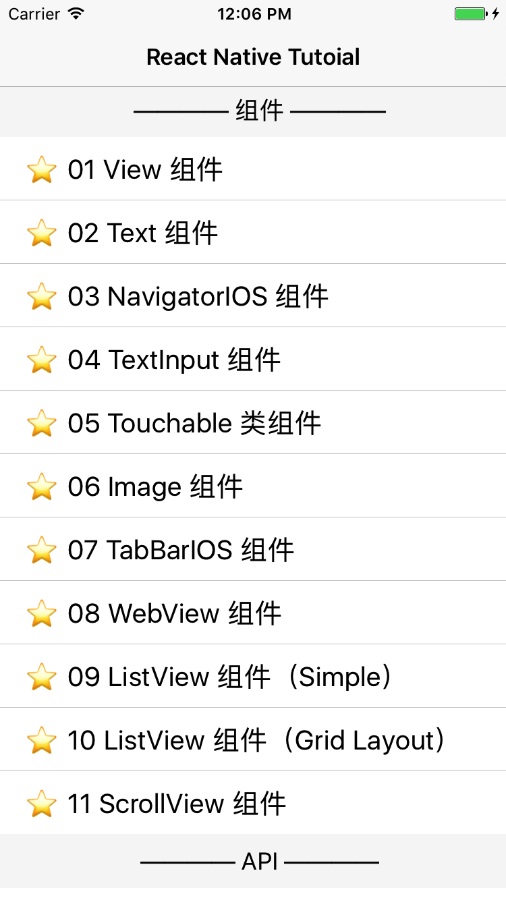
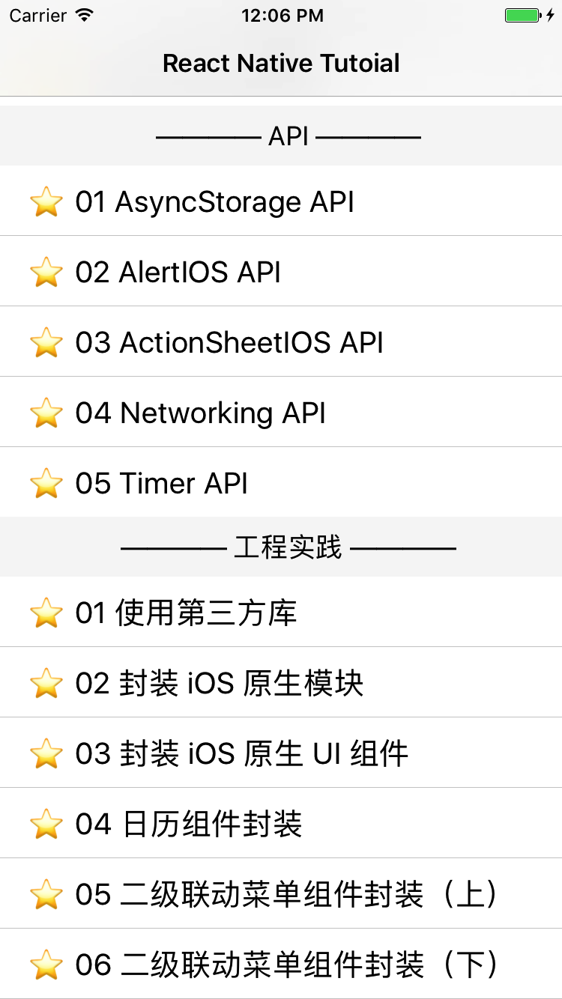
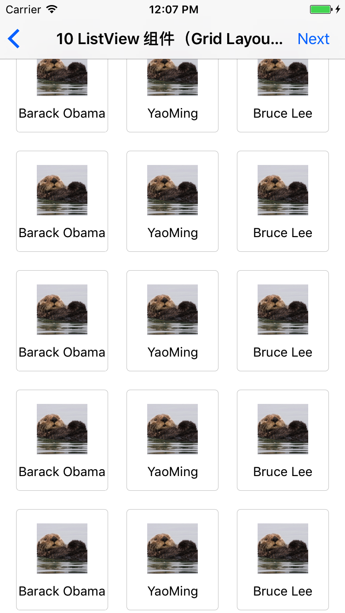
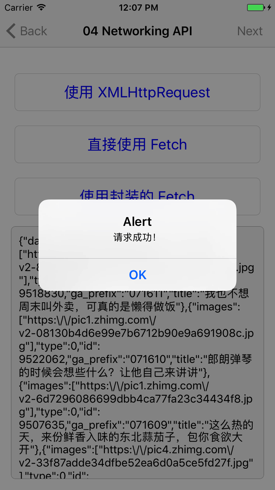
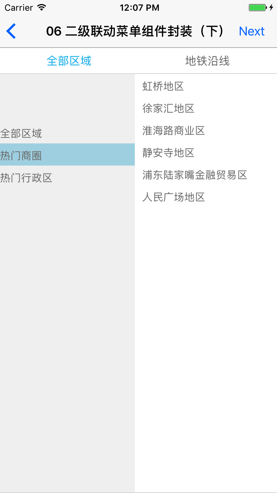
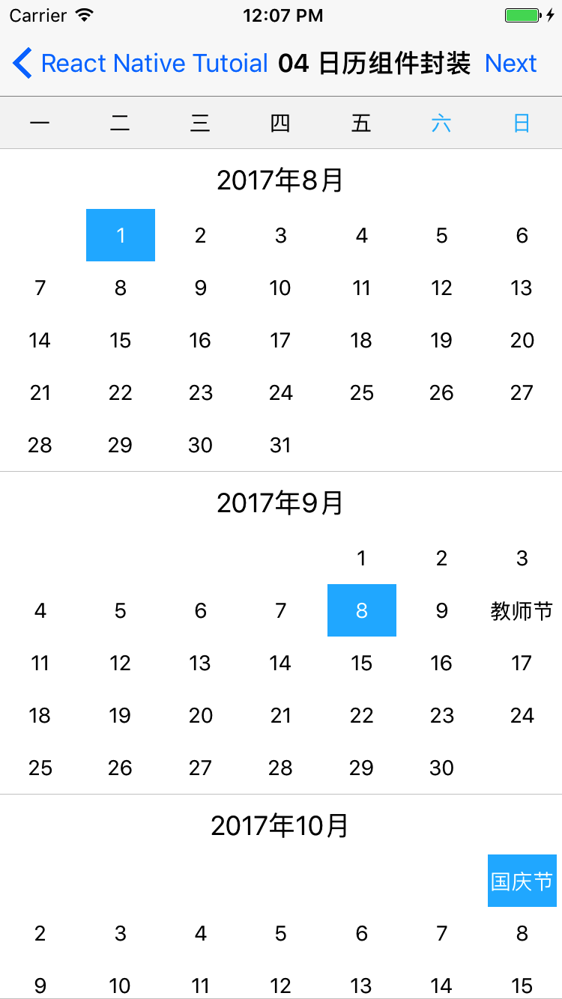

# AwesomeProject

一个 Tutorial Project，用来记录 [从 0 开始学习 React Native](https://github.com/ShannonChenCHN/AFrontEndWebDevTour/blob/master/React-Native/README.md) 的过程的小项目。

## Preview

## Thanks

- 感谢 [@vczero](https://github.com/vczero) 老师的《React Native 入门与实战》，提供了非常棒的学习方向和练习案例
- 感谢 [React Native 中文网](http://reactnative.cn/)翻译的教程和文档，让我能够更方便地查阅
- 感谢 facebook 的技术团队给我们开源了 React Native 这样一个牛逼的框架 
