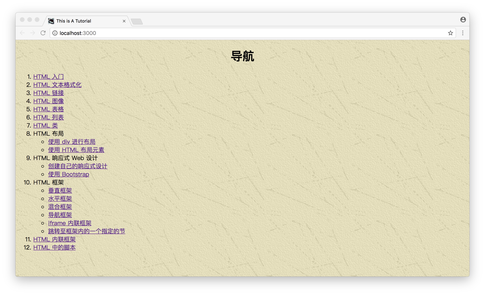
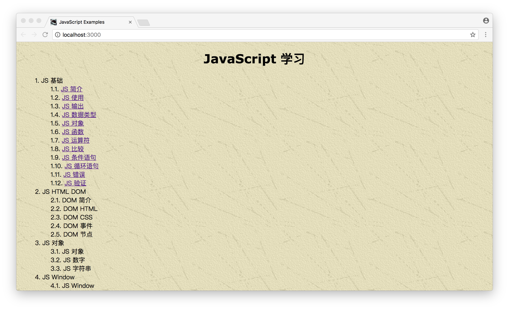

# AFrontEndWebDevTour
A journey of learning front-end development.

## 示例项目
- [HTMLExamples](https://github.com/ShannonChenCHN/AFrontEndWebDevTour/tree/master/learning-notes/HTMLExamples)

- [JavaScriptExamples](https://github.com/ShannonChenCHN/AFrontEndWebDevTour/tree/master/learning-notes/JavaScriptExamples)

## 学习笔记
### [Front-End Web Development 学习笔记](https://github.com/ShannonChenCHN/AFrontEndWebDevTour/blob/master/front-end-dev-book/README.md)
### [React Native 学习笔记](https://github.com/ShannonChenCHN/AFrontEndWebDevTour/blob/master/React-Native/README.md)
### [HTML 学习笔记](https://github.com/ShannonChenCHN/AFrontEndWebDevTour/blob/master/learning-notes/HTML-learning-notes.md)
### [CSS 学习笔记](https://github.com/ShannonChenCHN/AFrontEndWebDevTour/blob/master/learning-notes/CSS-learning-notes.md)
### [JavaScript 学习笔记](https://github.com/ShannonChenCHN/AFrontEndWebDevTour/blob/master/learning-notes/JavaScript-learning-notes.md)

